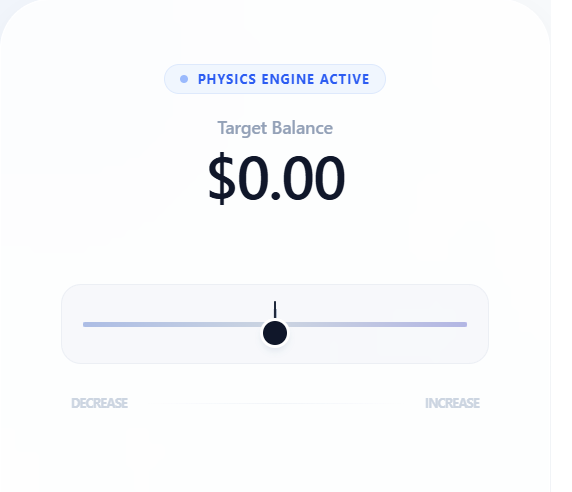

# Infinite Physics Slider



Slider for React. Designed for financial apps and complex inputs where you need to move from **$0.01** to **$1,000,000** without lifting your finger.

Unlike standard sliders that have a "start" and "end," this slider functions like a gas pedal. The further you pull it from the center, the faster the value changes.

[**Live Demo →**](https://damflancoz.github.io/infinite-slider/)

### Why use this?

  * **Infinite Range:** You aren't limited by the width of the screen.
  * **Surgical Precision:** Move slowly near the center for tiny adjustments.
  * **Hyper-Speed:** Pull to the edges to skyrocket through large numbers.
  * **Predictive Target:** A real-time "Look-Ahead" popup shows you exactly where the value will be in 500ms, allowing you to "brake" perfectly on your target.

-----

## Installation (shadcn/ui)
Add this component to your project with a single command:

```bash
npx shadcn@latest add https://damflancoz.github.io/infinite-slider/registry.json
```

-----

## Manual Setup

If you prefer to manage the code yourself, follow these steps:

### 1\. Install Dependencies

You'll need these common Tailwind utilities (standard in shadcn/ui projects):

```bash
npm install clsx tailwind-merge
```

### 2\. Copy the Component

Save this as `src/components/ui/infinite-slider.tsx`:

\<details\>
\<summary\>\<b\>Click to expand the full code block\</b\>\</summary\>

```tsx
import * as React from "react"
import { clsx, type ClassValue } from "clsx"
import { twMerge } from "tailwind-merge"

function cn(...inputs: ClassValue[]) {
  return twMerge(clsx(inputs))
}

export interface InfiniteSliderOptions {
  setAmount: (value: number | ((prev: number) => number)) => void;
  accelBase?: number;
  multiplier?: number;
  safeZoneWidth?: number;
  tickRate?: number;
  calcSpeed?: (distance: number) => number;
}

export interface InfiniteSliderProps extends InfiniteSliderOptions {
  className?: string;
  amount: number;
  showPrediction?: boolean;
}

const useInfiniteSlider = ({
  setAmount,
  accelBase = 100000,
  multiplier = 0.0001,
  safeZoneWidth = 0.00,
  tickRate = 25,
  calcSpeed
}: InfiniteSliderOptions) => {
  const [thumbPos, setThumbPos] = React.useState(0.5);
  const [isActivelyMoving, setIsActivelyMoving] = React.useState(false);
  const [prediction, setPrediction] = React.useState(0);

  const isDragging = React.useRef(false);
  const startX = React.useRef(0);
  const startThumbPos = React.useRef(0.5);
  const speedRef = React.useRef(0);
  const timerRef = React.useRef<number | null>(null);

  React.useEffect(() => {
    timerRef.current = window.setInterval(() => {
      if (speedRef.current !== 0) {
        setAmount(prev => {
          const nextVal = Math.max(0, prev + speedRef.current);
          const ticksAhead = 500 / tickRate;
          setPrediction(nextVal + (speedRef.current * ticksAhead));
          return nextVal;
        });
      }
    }, tickRate);
    return () => { if (timerRef.current) clearInterval(timerRef.current); };
  }, [tickRate, setAmount]);

  const handleStart = React.useCallback((clientX: number) => {
    isDragging.current = true;
    startX.current = clientX;
    startThumbPos.current = thumbPos;
  }, [thumbPos]);

  const handleMove = React.useCallback((clientX: number, sliderWidth: number) => {
    if (!isDragging.current) return;
    const deltaX = clientX - startX.current;
    const deltaPercent = deltaX / sliderWidth;
    const newThumbPos = Math.max(0, Math.min(1, startThumbPos.current + deltaPercent));
    setThumbPos(newThumbPos);
    
    const dist = newThumbPos - 0.5;
    const absDist = Math.abs(dist);

    if (absDist > safeZoneWidth / 2) {
      speedRef.current = calcSpeed 
        ? calcSpeed(dist) 
        : (dist > 0 ? 1 : -1) * Math.pow(accelBase, (absDist - (safeZoneWidth / 2)) / (0.5 - (safeZoneWidth / 2))) * multiplier;

      setIsActivelyMoving(absDist > 0.25); 
    } else {
      speedRef.current = 0;
      setIsActivelyMoving(false);
    }
  }, [accelBase, multiplier, safeZoneWidth, calcSpeed]);

  const handleEnd = React.useCallback(() => {
    isDragging.current = false;
    speedRef.current = 0;
    setThumbPos(0.5);
    setIsActivelyMoving(false);
  }, []);

  return { 
    thumbPos, 
    isDragging: isDragging.current, 
    isActivelyMoving, 
    prediction, 
    handleStart, 
    handleMove, 
    handleEnd 
  };
};

const InfiniteSlider = React.forwardRef<HTMLDivElement, InfiniteSliderProps>(
  ({ className, amount, showPrediction = true, ...props }, ref) => {
    const internalRef = React.useRef<HTMLDivElement>(null);
    const { 
      thumbPos, 
      isDragging, 
      isActivelyMoving, 
      prediction, 
      handleStart, 
      handleMove, 
      handleEnd 
    } = useInfiniteSlider(props);

    const onPointerDown = (e: React.PointerEvent) => {
      ;(e.target as HTMLElement).setPointerCapture(e.pointerId);
      handleStart(e.clientX);
    };

    const onPointerMove = (e: React.PointerEvent) => {
      const el = internalRef.current || (ref as React.MutableRefObject<HTMLDivElement>)?.current
      if (el) handleMove(e.clientX, el.offsetWidth)
    }

    return (
      <div className="relative w-full">
        {showPrediction && (
          <div 
            className={cn(
              "absolute -top-16 transition-all duration-200 pointer-events-none flex flex-col z-50",
              isActivelyMoving ? "opacity-100 translate-y-0 scale-100" : "opacity-0 translate-y-4 scale-95",
              thumbPos > 0.5 ? "right-0 items-end" : "left-0 items-start"
            )}
          >
            <div className="bg-slate-900 text-white px-3 py-1.5 rounded-xl shadow-2xl border border-slate-700/50 flex flex-col min-w-[100px]">
              <span className="text-[9px] text-slate-400 uppercase font-bold tracking-widest">Target (500ms)</span>
              <span className="text-lime-400 font-mono font-bold text-base">
                ${Math.max(0, prediction).toLocaleString(undefined, { minimumFractionDigits: 2, maximumFractionDigits: 2 })}
              </span>
            </div>
            <div className={cn(
              "w-3 h-3 bg-slate-900 rotate-45 -mt-1.5",
              thumbPos > 0.5 ? "mr-4" : "ml-4"
            )} />
          </div>
        )}

        <div
          ref={internalRef}
          onPointerDown={onPointerDown}
          onPointerMove={onPointerMove}
          onPointerUp={handleEnd}
          onPointerCancel={handleEnd}
          className={cn(
            "relative h-16 w-full touch-none select-none flex items-center justify-center cursor-ew-resize",
            "bg-slate-100/50 rounded-2xl border border-slate-200/60",
            className
          )}
        >
          <div className="absolute w-[90%] h-1 bg-slate-300 rounded-full pointer-events-none overflow-hidden">
            <div className="absolute inset-0 bg-gradient-to-r from-blue-600/10 via-transparent to-indigo-600/10" />
          </div>

          <div className="absolute left-[25%] right-[25%] h-1 border-x border-slate-400/20 pointer-events-none" />

          <div className="absolute left-1/2 w-0.5 h-6 bg-slate-400 -translate-x-1/2 pointer-events-none" />

          <div
            className={cn(
              "absolute flex flex-col items-center pointer-events-none transition-transform",
              !isDragging && "duration-300 ease-out"
            )}
            style={{ 
              left: `${thumbPos * 100}%`,
              transform: 'translateX(-50%)'
            }}
          >
            <div className={cn(
              "w-0.5 h-4 mb-[-2px] transition-colors rounded-full",
              isDragging ? "bg-blue-600" : "bg-slate-800"
            )} />

            <div
              className={cn(
                "w-6 h-6 rounded-full border-[2.5px] border-white shadow-md transition-all",
                isDragging ? "bg-blue-600 scale-110 shadow-blue-100" : "bg-slate-900 shadow-slate-200"
              )}
            />
          </div>
        </div>
      </div>
    )
  }
)
InfiniteSlider.displayName = "InfiniteSlider"

export { InfiniteSlider }
```

\</details\>

-----

## 📖 Usage

Drop it into any component. You provide the `amount` state, and the slider "drives" it.

```tsx
import { useState } from "react";
import { InfiniteSlider } from "./components/infinite-slider";

export default function MyInput() {
  const [amount, setAmount] = useState(100);

  return (
    <div className="p-10">
      <h1 className="text-2xl font-bold">${amount.toFixed(2)}</h1>
      
      <InfiniteSlider 
        amount={amount}
        setAmount={setAmount} 
        className="mt-8"
      />
    </div>
  );
}
```

-----

## API

| Prop | Type | Default | Description |
| :--- | :--- | :--- | :--- |
| `amount` | `number` | **Required** | The current numeric value. |
| `setAmount` | `function` | **Required** | State setter. |
| `showPrediction`| `boolean`| `true` | Toggle the 500ms look-ahead popup. |
| `accelBase` | `number` | `100000` | Higher = more extreme speed at the edges. |
| `multiplier` | `number` | `0.0001` | Overall sensitivity modifier. Lower = slower in the middle |
| `safeZoneWidth` | `number` | `0.00` | Width (0-1) of center deadzone. |

### Custom Physics Example

Want a simple linear speed instead of an exponential one?

```tsx
<InfiniteSlider 
  setAmount={setAmount}
  calcSpeed={(dist) => dist * 10} // Linear speed based on distance
/>
```

-----

## 🧠 The "Gas Pedal" Concept

The slider doesn't set the value based on where the thumb is. Instead, it calculates a **Velocity** ($V$) based on the distance ($d$) from the center line.

$$V = \text{direction} \times \text{accelBase}^{\text{intensity}} \times \text{multiplier}$$

This means that near the center marker ($d \approx 0$), the speed is nearly zero, giving you fine-tuned control. As you reach the edges, the exponent takes over, allowing you to fly through massive numbers without ever letting go of the mouse.

### Predictive Look-Ahead

To make physics-based input feel controlled, the slider calculates where the value will be in the future:
$$P = \text{CurrentValue} + (V \times 500\text{ms})$$

This popup only appears when you exit the **middle 50%** of the slider, ensuring it doesn't clutter the UI during fine-tuned, slow adjustments.